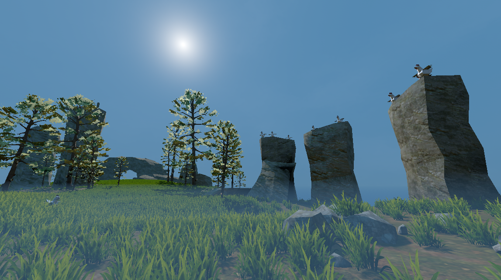

# Godot-Blender RPG Framework

## Welcome early visitor

This project has just been started! Come back soon!

## Introduction

This repository is a collection of freely usable art, scripts, and sounds that hopes to benefit many projects.

### Purpose and structure

The primary goal of the Godot-Blender RPG Framework is to serve as a way to test the contents of the StandardAssets repository. We will do this by creating a small mini-game, a single quest for the player to accomplish.

#### Standard Assets
The StandardAssets repository is a submodule that aims to be a lightweight and reusable collection of scripts, textures, materials, and so on. Since I use this submodule for my own games, any form of feedback or collaboration is greatly appreciated.

## Installation

This project depends on, but does not include, the following plug-ins:

1) [Terrain3D](https://github.com/TokisanGames/Terrain3D)
2) [Godot Dialogue Manager](https://github.com/nathanhoad/godot_dialogue_manager)
3) [Phantom Camera](https://github.com/ramokz/phantom-camera)

First, download current versions of these programs and place them into /addons/.

Next, to install this project, simply type,

`git clone --recurse-submodules https://github.com/sci-comp/GodotBlenderRPGFramework`

or use Github Desktop. By cloning with `--recurse-submodules`, the [StandardAssets](https://github.com/sci-comp/StandardAssets) and [EditorToolbox](https://github.com/sci-comp/EditorToolbox) submodules will automatically be included.

Next, we must generate our C\# solution by clicking: Project \> Tools \> C\# \> Create C\# solution

We should now be able to build and play.

### Adding and Removing Submodules

The following are helpful reminders for adding and removing submodules.

Note for Github Desktop users: Github Desktop cannot add or remove submodules. However, once a submodule has been added through the console, we can manage it from within the Github Desktop UI.

We can add submodules individually by,

	- git submodule add --force https://github.com/sci-comp/ExampleSubmodule addons/ExampleSubmodule
	- git submodule init
	- git submodule update

We remove submodules individually by,

	- git submodule deinit -f addons/ExampleSubmodule
	- git rm --cached addons/ExampleSubmodule
	- rm -r addons/ExampleSubmodule

If we delete a submodule without first calling submodule deinit, which is an easy mistake to make, then we have to manully remove the submodule references in the following locations,

	- ./.git/config
	- ./.git/modules/

## License

All content was originally in the public domain, or under the MIT license. Please see license.txt files in their respective folders for specific information. A partial summary of contents is also included here,

### Standard Assets

- The lookup tables for color grading come from this project: https://github.com/thiagoamendola/godot-color-lut-shader
- While making the scene manager, I used the following repository for guidance: https://github.com/glass-brick/Scene-Manager
- A copy of Sky3D has been included, which will be kept up to date: https://github.com/TokisanGames/Sky3D

### Art

- FlynnCat: https://flynncat.itch.io/mrd-terrain
- Kenney: https://kenney.itch.io/
- Sound files by FilmCow
